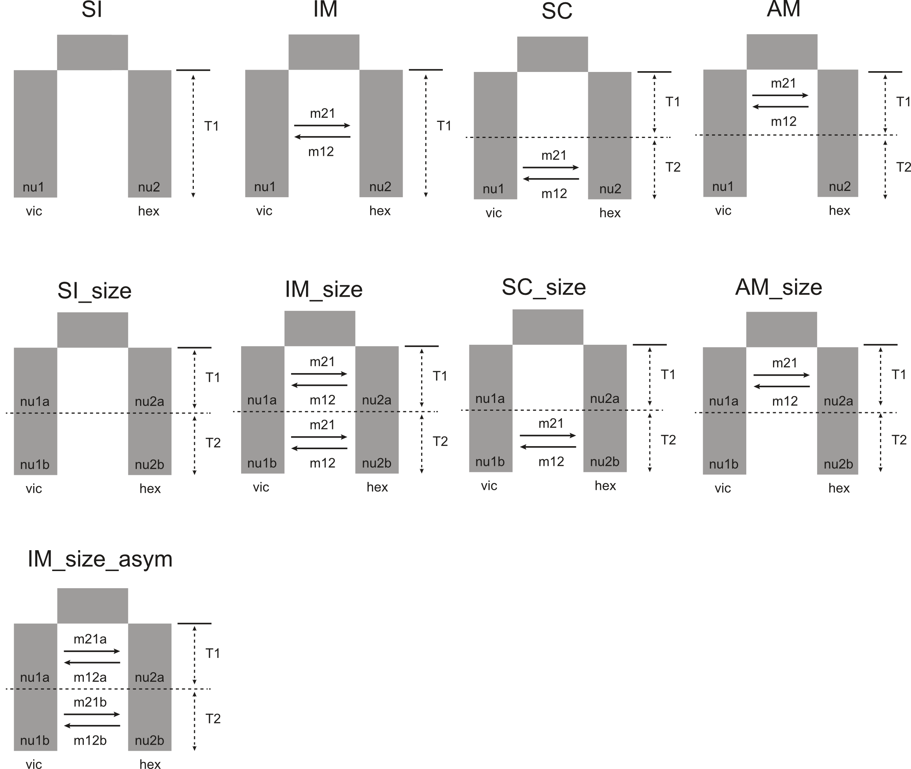

Whether or not you need to downproject your SFS depends on the amount of missing data you have. For more info on downprojection, see https://dadi.readthedocs.io/en/latest/user-guide/manipulating-spectra/  
<br>
Don't forget the number of samples is counted in haploids here, and we have diploid species  
<br>
Samples are separated by species (don't forget we removed O. victoriae from South Georgia and O. hexactis from Bransfield Mouth)
```{bash, error=TRUE, results='hide'}
#O. victoriae
singularity run $SING/angsd-0.940.sif realSFS vic.saf.idx -fold 1 > vic_rmhighimiss_rmSG.sfs

#O. hexactis
singularity run $SING/angsd-0.940.sif realSFS hex.saf.idx -fold 1 > hex_rmBM.sfs

#2D SFS (unfolded) between vic and hex (vicrmhighimissSG, hexrmBM)
#then fold it within dadi
singularity run $SING/angsd-0.940.sif realSFS vic.saf.idx hex.saf.idx > vic_hex_unfolded.sfs
```

Visualise sfs
```{bash, error=TRUE, results='hide'}
ipython

import dadi
import pylab

cd ./ophionotus/analyses/dadi/

#2d-SFS with 50% downprojection
fs = dadi.Spectrum.from_file("./ophionotus/analyses/dadi/vic_hex_unfolded.sfs")
folded = fs.fold()
proj = folded.project([153, 30])
dadi.Plotting.plot_single_2d_sfs(folded, vmin = 0.001)
pylab.show()

```

## Running dadi
Here we use dportik/dadi_pipeline: https://github.com/dportik/dadi_pipeline
<br>
See ./hpc/dadi folder for dadi_Run_2D_Set.py, Models_2D.py and Optimize_Functions.py  
Make sure all .py scripts are located in the same folder that we will run dadi out of  
<br>

**Illustrations of models that were tested in dadi**  



Running dadi on Terminal (do 1 job per model to speed things up)
```{bash, error=TRUE, results='hide'}
module load cuda/11.3.0
module load anaconda
source activate ./.conda/envs/dadi

cd ./ophionotus/analyses/dadi/SI

python dadi_Run_2D_Set.py

#All dadi models returned being very bad fits (due to biological reasons) so we didn't explore the best model & parameter estimates
```
